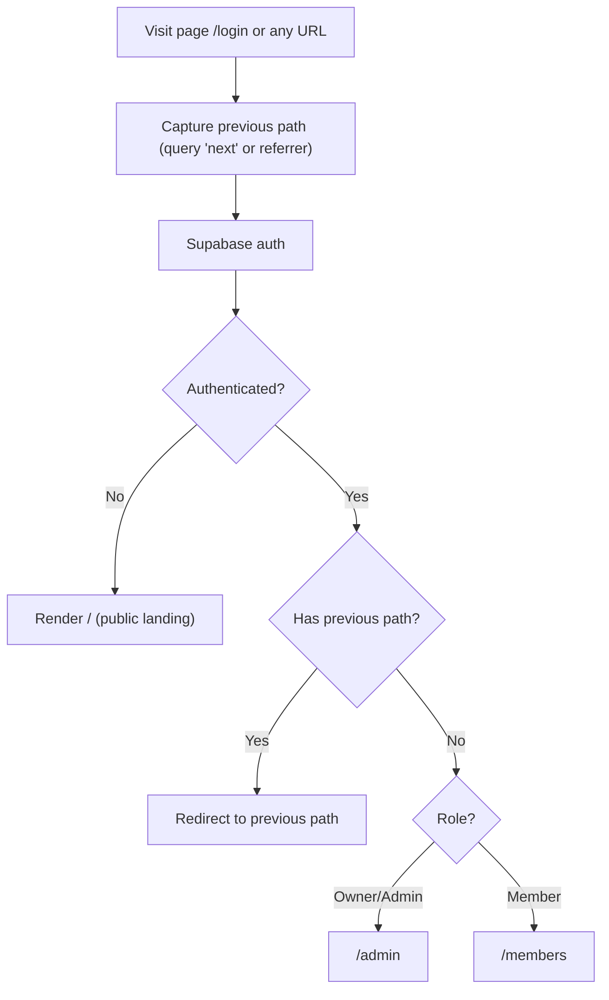
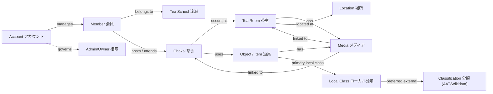

### Spec: Role‑aware landings, English NavBar, Japanese descriptive copy

## Overview
- **Objective**: Clarify first-run navigation and present informative, interconnected landing pages.
- **Outcome**: Logged-in admins/owners land on Admin; members on Members; visitors see the public top page. Login honors previous path. NavBar uses English-only labels; pages use Japanese alongside English for domain terms and explanations.

## Key decisions and constraints
- **NavBar**: English-only labels; no language toggle.
- **Copy approach**: Navigation and buttons in English; descriptive text can include Japanese terms (e.g., “Chakai 茶会”).
- **Login redirect**: Honor prior path via `next` query; if absent/invalid, default by role.
- **Server-side redirects**: Avoid client-side flicker.
- **Classification model**: Objects link to Local Classes (primary). Local Classes link to a preferred external Classification (AAT/Wikidata). No direct object→classification links.

## Information Architecture and Routing
- `/` (root):
  - Logged out → render public landing.
  - Logged in (coming from login without a valid `next`) → role-based redirect.
- `/members`: Member dashboard focused on user actions and recent activity.
- `/admin`: Admin dashboard with system-wide management.

### Login redirect flow (honor previous path)

## Domain overview (entities and connections)

## Terminology: Local Class vs Classification
- **Local Class (ローカル分類)**: The category/class taxonomy used on this server. Curated locally for this collection and project needs. Each Item/Object chooses a single primary Local Class. “Local” means it is maintained within this project, not a global authority.
  - 日本語: 本サーバーで使用する分類体系。プロジェクト内で管理し、各オブジェクトの主要分類（primary）として1つを選びます。外部の標準語彙ではなく「ローカル」に定義・運用します。
- **Classification (分類; AAT/Wikidata)**: Canonical/authoritative categories from Getty AAT and Wikidata. Objects do not link to these directly. Instead, a Local Class may link to a preferred external classification, which we use for authority labels and JSON‑LD typing.
  - 日本語: Getty AAT や Wikidata の標準的な概念（権威データ）。オブジェクトから直接は紐付けず、ローカル分類が「代表（preferred）」として外部分類にリンクします。この外部リンクを参照してラベルや JSON‑LD のタイプを解決します。

## Accounts vs Members（アカウントと会員の違い）
- **Account (アカウント)**: Sign‑in identity. Stores email and role (owner/admin/member). Used for authentication and authorization.
  - 日本語: サインイン用の利用者情報。メールとロール（owner/admin/member）を保持し、認証・認可に使用します。
  - Relationships: An Account may be linked to zero or more Member profiles it can edit; owners/admins can manage many. Some Accounts may have no linked Member.
    - 日本語: アカウントは0件以上の会員プロフィールにリンクでき、管理者は複数を管理できます。リンクが無いアカウントも存在します。
- **Member (会員)**: Tea‑domain person/profile. Belongs to a Tea School, can host/attend Chakai, and relate to Media/Items.
  - 日本語: 茶道ドメインの人物プロフィール。流派に所属し、茶会に参加・主催し、メディアや道具と関係します。ログイン情報ではありません。
  - Independence: Members can exist without Accounts (e.g., historical figures or participants without logins).
    - 日本語: ログインの無い人物（歴史上の人物など）も会員として存在できます。

Notes for routing and UI:
- Role‑based redirects use the Account’s role (owner/admin/member).
- The Members dashboard defaults to the Account’s linked Member profile when present; otherwise prompt to create/select a Member.
- Admin pages allow viewing/managing all Members regardless of linkage.

## NavBar (English-only labels)
- Visitor:
  - Home → `/`
  - Lookup → `/lookup`
  - Login → `/login`
- Member:
  - Members → `/members`
  - Chakai → `/chakai`
  - Tea Rooms → `/tea-rooms`
  - Lookup → `/lookup`
  - Logout → `/logout`
- Admin/Owner:
  - Admin → `/admin`
  - Accounts → `/admin/accounts`
  - Chakai → `/admin/chakai`
  - Items → `/admin/items`
  - Media → `/admin/media`
  - Local Classes → `/admin/local-classes`
  - Classifications → `/admin/classifications`
  - Tea Schools → `/admin/tea-schools`
  - Members → `/admin/members`
  - Lookup → `/lookup`
  - Logout → `/logout`

Notes:
- Keep labels short; page headers and descriptions can include Japanese terms.
- On mobile, collapse trailing items into a “More” menu if needed.
- Local Classes are the primary taxonomy here; Classifications are external authorities referenced via Local Classes.
- “Members” links to the member dashboard tied to the signed‑in Account’s linked Member (if any). “Accounts” (admin) manages login identities and roles.

## Page designs

### Public landing `/` (logged out)
- Hero
  - Title: “Chanoyu Collections”
  - Subhead: “Preserve and share tea ceremony knowledge. 茶道の記録と共有”
  - CTAs: “Log in”, secondary “Browse Lookup”
- Overview grid (entity cards)
  - Chakai 茶会 — “Host and document tea gatherings. 茶会の記録・共有”
  - Tea Rooms 茶室 — “Rooms and places where tea is served. 茶室・場所”
  - Items 道具 — “Implements used in tea ceremony. 茶道具”
  - Media メディア — “Photos/files linked to items, tea rooms, and events. 写真・資料”
  - Classifications 分類 — “External authorities linked via Local Classes. ローカル分類から参照する標準語彙”
  - Local Classes ローカル分類 — “Project-specific groupings and primary item classification. プロジェクトの主要分類”
  - Tea Schools 流派 — “Lineages and schools of tea. 流派”
  - Members 会員 — “People participating and contributing. 参加・貢献者”
- How it fits together
  - “Chakai use Items, occur in Tea Rooms, and have Media. Items are described by Local Classes; external types come from each Local Class’s preferred Classification (AAT/Wikidata). Members host/attend Chakai and belong to Tea Schools.”
- Terminology note: Local Classes are the project’s own categories (ローカル分類). Classifications are canonical external authorities (Getty AAT / Wikidata) referenced from Local Classes.
- Footer: “About”, “Privacy”, “Contact”

### Members landing `/members`
- Header: “Members — 会員”
- Quick actions
  - “Start a Chakai” — “Create a new gathering. 新しい茶会を作成”
  - “Add Item” — “Register a tool. 道具を追加”
  - “Upload Media” — “Attach photos/files. 写真・資料を追加”
  - “Create Tea Room” — “Add a room/place. 茶室を追加”
- My recent activity
  - “Recent Chakai”, “Recent Media”, “Recent Edits”
  - Empty states: “No Chakai yet — Start a Chakai”; “No media yet — Upload Media”
- Learn the model
  - “Chakai (茶会) happen in Tea Rooms (茶室) and use Items (道具). Link Media (メディア) to document. Describe Items with Local Classes (ローカル分類). External types are resolved via the Local Class preferred Classification (分類).”
- Linked profile note: If the signed‑in Account has no linked Member profile, offer “Create Member profile” (会員プロフィールを作成) or “Select existing Member to link” (既存の会員にリンク)。
- Terminology note: Local Classes = project taxonomy (primary). Classifications = external authorities linked from Local Classes.

### Admin landing `/admin`
- Header: “Admin — 管理”
- System management cards
  - Accounts アカウント — “User roles and access. 権限管理”
  - Chakai 茶会 — “Oversee gatherings. 監督・調整”
  - Items 道具 — “Inventory and details. 在庫・詳細”
  - Media メディア — “Library and linking. ライブラリ・紐付け”
  - Local Classes ローカル分類 — “Project-specific grouping; link a preferred external classification. プロジェクト分類（代表外部リンク）”
  - Classifications 分類 — “AAT/Wikidata authorities linked from Local Classes. 標準語彙（ローカル分類から参照）”
  - Tea Schools 流派 — “Lineages and schools. 流派”
  - Members 会員 — “People and profiles. 会員情報”

- Page header help (suggested):
  - Local Classes: “Local Class (ローカル分類) is our project’s category. Each item selects one primary Local Class. It may link to a preferred external Classification (AAT/Wikidata).”
  - Classifications: “Classifications (分類) are canonical external authorities from Getty AAT and Wikidata. Objects do not link here directly; they inherit via Local Classes.”

## Copy inventory (centralized constants)
- Entities and display names
  - Chakai / 茶会
  - Tea Rooms / 茶室
  - Items / 道具
  - Media / メディア
  - Local Classes / ローカル分類
  - Classifications / 分類
  - Tea Schools / 流派
  - Members / 会員
  - Accounts / アカウント
- CTA labels
  - Explore, Create, Add, Upload, Manage, View, Start a Chakai, Log in, Browse Lookup
- Short descriptions
  - Use the sentences provided in the page designs above.

- Usage notes
  - Objects never link directly to external Classifications; they select a Local Class (primary), which may reference a preferred Classification.
  - 日本語: オブジェクトは外部分類に直接紐付けません。まずローカル分類（主要）を選び、そのローカル分類が代表の外部分類にリンクします。

## UX details
- English-only NavBar; Japanese appears in names and explanations.
- Pair EN heading with JA term inline (lighter color acceptable); keep body copy concise.
- Provide tooltips where helpful, e.g., “Classifications — Authoritative terms from AAT/Wikidata. 分類（標準語彙）”.
- Also add: “Local Classes — Project taxonomy used for primary categorization. ローカル分類（本プロジェクトの分類体系）”.
- Responsive cards with stable heights; cap description length.

## Login redirect details
- Accept `next` query param at `/login` and propagate through auth.
- Validate `next` as same-origin path. If invalid, ignore.
- After auth:
  - If valid `next`, redirect there (preserve hash/query).
  - Else, role-based defaults: Owner/Admin → `/admin`, Member → `/members`, otherwise `/`.
- Clear any temporary cookie used to store `next` after redirect.

## Acceptance criteria
- Login respects previous path via validated `next`, with role-based fallback.
- NavBar is English-only; pages include JA terms in names/explanations.
- Public landing explains entities and relationships; Members/Admin landings are task-first.
- No privileged links for non-admins; routing is server-side without flicker.
- Copy and diagrams reflect Local Class–first classification (no direct object→classification link implied).
- The distinction between Accounts and Members is clearly documented (EN/JA) and reflected in Members dashboard behavior and Admin “Accounts” scope.

## Open questions
- Exact member quick actions beyond the starters listed here.
- Whether to include a relationships diagram on the public landing or link to it.
- Deep-link login from protected routes: ensure all such routes set `next` automatically.

## References
- See Architecture: [docs/ARCHITECTURE.md](../docs/ARCHITECTURE.md)
- See Migration plan for removing direct object→classification links: [docs/PLAN_remove_direct_classification_links.md](../docs/PLAN_remove_direct_classification_links.md)

## Implementation checklist (for the agent)
- Routing and auth
  - Implement role-aware landing in `app/page.tsx` (server component). Logged-out → render public landing; logged-in → role-based redirect when no valid `next`.
  - Ensure `/login` honors `next`: validate same-origin path, preserve query/hash, clear any temp cookie after redirect.
  - Add/confirm role helper in `lib/auth.ts` or `lib/supabase/server.ts` returning `owner | admin | member | visitor` and linked Member id (if any).

- Members landing
  - Create `app/members/page.tsx` (server): header, quick actions, recent activity, and “Learn the model”.
  - If no linked Member profile for the Account, show prompts: “Create Member profile” or “Select existing Member to link”.

- Admin landing
  - Update `app/admin/page.tsx` to card layout: Accounts, Chakai, Items, Media, Local Classes, Classifications, Tea Schools, Members.
  - Add header help clarifying Local Class vs Classification.

- NavBar (English-only)
  - Update `app/components/NavBar.tsx` and `app/components/NavBarClient.tsx` to be role-aware.
  - Visitor: Home, Lookup, Login. Member: Members, Chakai, Tea Rooms, Lookup, Logout. Admin: Admin, Accounts, Chakai, Items, Media, Local Classes, Classifications, Tea Schools, Members, Lookup, Logout.
  - Hide privileged links for non-admins; ensure “Members” points to `/members` and “Accounts” (admin) manages login identities/roles.

- Copy and tooltips
  - Centralize strings in `lib/branding.ts` (or extend `lib/translate.ts`): entity labels, short descriptions, CTAs, and terminology definitions.
  - Add tooltips: Local Classes — “Project taxonomy (ローカル分類)”; Classifications — “External authorities (AAT/Wikidata)”.

- JSON-LD and model alignment
  - Confirm external types are resolved via Local Class preferred Classification in `lib/jsonld.ts` and related routes (`app/id/[token]/jsonld/route.ts`, `app/api/ark/[naan]/[...name]/route.ts`).
  - Ensure page copy matches Local Class–first model; no UI implying direct object→classification links.

- Tests and QA
  - Add tests for login redirect honoring `next`; role-based defaulting; NavBar visibility by role.
  - Verify existing JSON-LD tests reflect Local Class preferred external classification.
  - Manual test matrix: visitor/member/admin flows; mobile/desktop; no client flicker; privileged links hidden.

- Documentation
  - Cross-link `docs/ARCHITECTURE.md` and `docs/PLAN_remove_direct_classification_links.md` from this spec.
  - Ensure terminology (EN/JA) matches across docs.

- Accessibility and responsiveness
  - Focus states, touch targets (≥44px), high contrast; ensure EN/JA copy does not overflow cards on small screens.
